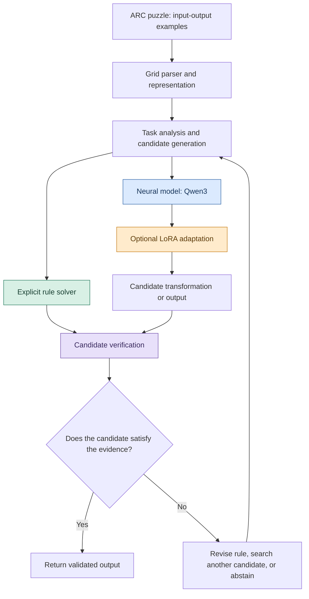
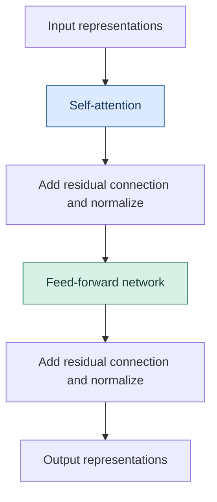
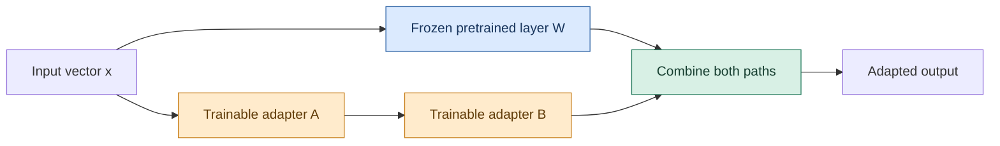
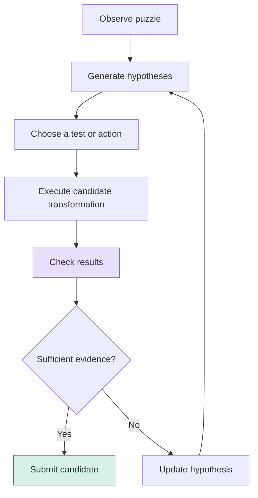
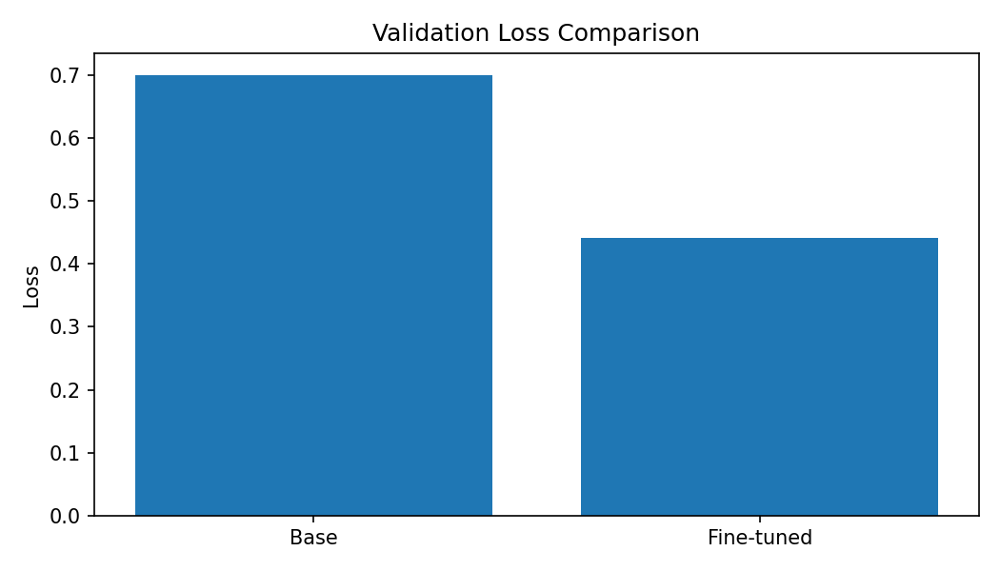
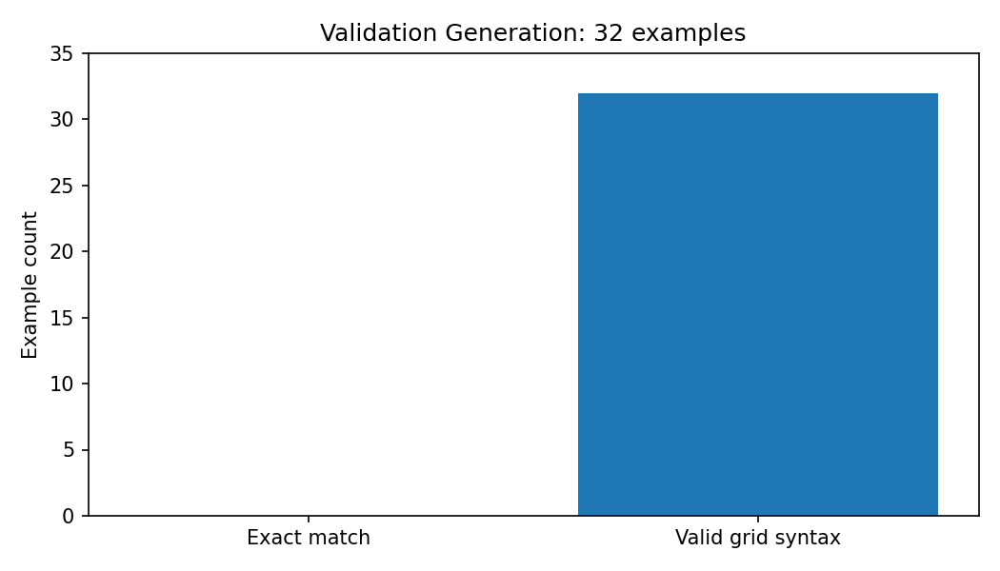
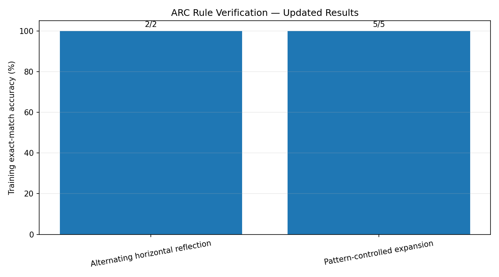
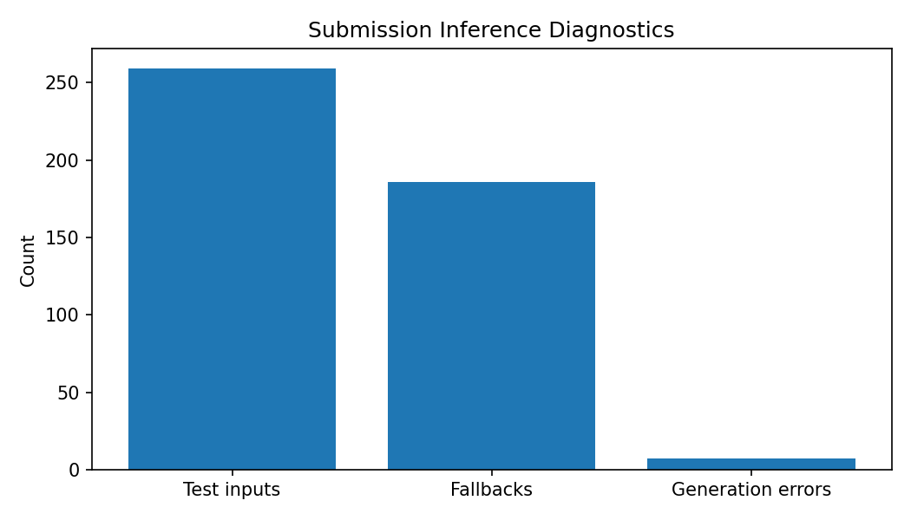
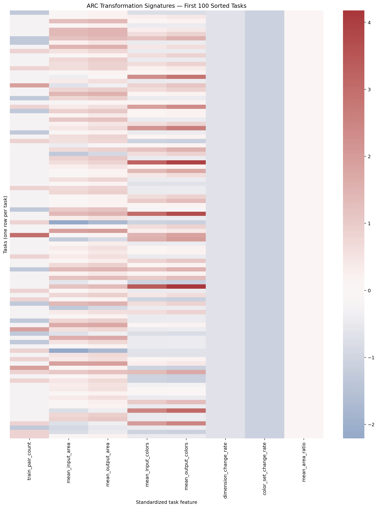

# ARC-Gis: Building AI That Learns to Reason

### From visual pattern recognition to rule discovery, adaptive computation, and generalization

<p align="center">
  <strong>Can an AI learn a new rule from just a handful of examples—and apply it to a puzzle it has never seen before?</strong>
</p>

<p align="center">
  <a href="https://github.com/ut1776/arc-agi-2-reasoning">Repository</a> ·
  <a href="https://www.kaggle.com/competitions/arc-prize-2026-arc-agi-2">ARC-AGI-2 Competition</a> ·
  <a href="https://github.com/arcprize/ARC-AGI-2">Dataset and benchmark</a>
</p>

---

## The big idea

Most AI systems learn statistical patterns from large amounts of data. But recognizing a familiar pattern is not the same as discovering a rule, understanding when it applies, and using it in a new situation.

**ARC-Gis explores how to build systems that can solve unfamiliar visual reasoning problems by combining learned models with explicit, testable rules.**

The project investigates two complementary approaches:

* **Neural reasoning:** experimenting with Qwen3, a pretrained transformer language model, and parameter-efficient fine-tuning with Low-Rank Adaptation (LoRA).
* **Explicit reasoning:** analyzing ARC grids, testing candidate transformations, and checking whether proposed rules reproduce the observed examples exactly.

The long-term ambition is to investigate whether these approaches can work together to improve generalization on ARC-AGI-2, with a stretch goal of reaching 85% task accuracy. That is a research target, not a result this repository currently claims.

> **The central research question:** Can we combine the flexibility of neural networks with the precision, transparency, and verifiability of explicit rules?

## 1. Why ARC-AGI-2 matters

The Abstraction and Reasoning Corpus (ARC) evaluates a distinctive kind of intelligence: learning a transformation from a small number of input-output examples.

Each puzzle contains colored grids. The solver must infer the transformation connecting the examples and apply it to a new input.

For example, a puzzle might require an AI to discover that:

* a shape should be reflected across an axis;
* a pattern determines where objects should appear;
* a particular color marks an object to move;
* a grid should expand according to a repeated structure;
* or a transformation changes the dimensions of the output.

The challenge is that the intended rule is not usually provided.

### What an ARC puzzle looks like

A simplified illustration:

**Examples**

```text
Input                 Output

0 0 0 0               0 0 0 0
0 2 0 0               0 0 0 0
0 0 0 0               0 0 2 0
0 0 0 0               0 0 0 0
```

The solver must infer the relationship between the input and output. This toy example illustrates a possible transformation; it is not presented as an official competition task.

The real difficulty is discovering the correct rule from only a few demonstrations, then applying it to a different input without simply memorizing the examples.

### Why this is different from ordinary prediction

| Ordinary pattern recognition                  | ARC-style reasoning                              |
| --------------------------------------------- | ------------------------------------------------ |
| Recognize familiar patterns                   | Infer an unknown transformation                  |
| Learn from many examples                      | Often learn a rule from a few examples           |
| Predict likely outputs                        | Produce an output satisfying the inferred rule   |
| May rely on familiar statistical associations | Must generalize to novel combinations            |
| Accuracy can hide brittle behavior            | Exact output correctness is especially important |

ARC-AGI-2 is not a perfect or complete measure of intelligence. It is a demanding benchmark designed to investigate generalization and abstract reasoning.

Learn more: [ARC-AGI-2 competition](https://www.kaggle.com/competitions/arc-prize-2026-arc-agi-2) · [ARC Prize dataset repository](https://github.com/arcprize/ARC-AGI-2) · [On the Measure of Intelligence](https://arxiv.org/abs/1911.01547).

---

## 2. The system architecture

ARC-Gis is a research project, not a new foundation model. It explores how different methods might contribute to a more capable reasoning system.

The current work includes dataset analysis, explicit rule verification, and a Qwen3 fine-tuning experiment. The integrated architecture below is a **proposed direction**, not a claim that every component is already implemented.



### What each component does

**1. Grid parser**

Converts the colored grid into a structured representation. A grid is not merely an image: each cell has a discrete color value, usually represented by an integer from 0 to 9.

**2. Task analysis**

Extracts properties such as grid dimensions, color frequencies, object arrangements, and differences between input and output grids.

**3. Explicit rule solver**

Tests understandable transformations, such as reflection, repetition, color substitution, or pattern-controlled expansion. A rule is useful only when its predictions match the observed examples.

**4. Neural model**

Uses learned representations to generate candidate explanations, transformations, or outputs. Its flexibility is valuable, but its predictions can be inconsistent or incorrect.

**5. Candidate verification**

Checks whether a proposed rule reproduces the training examples and whether the generated output has a valid grid structure. Passing training checks is evidence of consistency—not proof that the inferred rule is correct on an unseen test.

**6. Search and revision**

If the candidate fails, the system may try another rule, change its representation, or allocate more computation. This is a proposed research direction; the present experiments do not establish that a complete adaptive search agent has been implemented.

---

## 3. Transformers, explained from first principles

A transformer is a neural network architecture introduced in the paper [Attention Is All You Need](https://arxiv.org/abs/1706.03762).

Transformers are used in many language models and other AI systems because they can process relationships among elements in a sequence.

### A simple mental model

Imagine a sentence containing the word “bank.” Depending on the surrounding words, it could refer to a financial institution or the side of a river.

A transformer uses **attention** to help determine which other elements are relevant when representing each element.

For ARC-Gis, the analogous challenge is deciding which cells, shapes, colors, and relationships matter to a puzzle's transformation.

### Inside a transformer block



* **Representations:** numerical vectors that encode information about tokens.
* **Self-attention:** calculates how much different elements should influence one another.
* **Feed-forward network:** transforms each position's representation.
* **Residual connections and normalization:** help information flow through deep networks and stabilize training.

A full transformer stacks many such blocks. The architecture does not automatically guarantee logical reasoning: the model must learn useful behavior from its training and inference process.

### Why Qwen3?

This project uses the Qwen3 1.7B base checkpoint available in the Kaggle environment.

The inspected model configuration reported:

| Property            | Value                                   |
| ------------------- | --------------------------------------- |
| Model family        | Qwen3                                   |
| Checkpoint          | 1.7B base                               |
| Transformer layers  | 28                                      |
| Hidden dimension    | 2,048                                   |
| Experiment hardware | Tesla T4 GPU, 15 GB reported GPU memory |

These details describe the inspected checkpoint and experiment environment, not every Qwen3 variant.

Qwen3 was selected as an experimental starting point for studying whether a pretrained language model can learn a structured ARC output format and improve its behavior through fine-tuning.

Reference: [Qwen3 Technical Report](https://arxiv.org/abs/2505.09388).

---

## 4. LoRA: teaching a large model with a small adapter

Fine-tuning traditionally updates some or all of a model's parameters using task-specific training data. This can be expensive for a large model.

**Low-Rank Adaptation (LoRA)** offers an alternative: freeze the original weights of selected layers and train smaller additional matrices that modify their effective computation.

### A 3D-style architectural view

The following is a conceptual layer diagram rendered directly by GitHub. It is not a photograph or a literal 3D model of Qwen3's internal hardware.



Think of the pretrained model as a large machine that already contains learned capabilities. Instead of rebuilding the entire machine, LoRA trains a small adjustment mechanism that changes how selected layers behave.

The original weights remain frozen in the adapted layers; the LoRA matrices are trainable.

### The mathematics behind LoRA

Let \(W_0\) be a pretrained weight matrix. A LoRA adaptation expresses the effective weights as:

$$
W = W_0 + \Delta W
$$

where

$$
\Delta W = BA
$$

The dimensions are chosen so that the matrix product has the same shape as \(W_0\). If the rank \(r\) is much smaller than the original matrix dimensions, the additional trainable parameter count can be substantially reduced.

For a matrix \(W_0\) with shape \(d_{\text{out}}\times d_{\text{in}}\), a common LoRA configuration uses

$$
A\in\mathbb{R}^{r\times d_{\text{in}}},
\qquad
B\in\mathbb{R}^{d_{\text{out}}\times r}
$$

so the adapter contains \(r(d_{\text{in}}+d_{\text{out}})\) parameters rather than \(d_{\text{in}}d_{\text{out}}\) parameters for a full matrix update.

The original LoRA formulation often includes a scaling factor:

$$
W = W_0 + \frac{\alpha}{r}BA
$$

Here, \(r\) is the adapter rank and \(\alpha\) is a scaling hyperparameter. The exact rank, scaling, and target modules should be read from the actual experiment configuration; this README does not assume values that have not been verified.

### Why LoRA may help

* Lower training memory requirements than updating all model weights.
* Fewer trainable parameters.
* Faster experimentation with task-specific adaptations.
* The ability to preserve a shared base model while storing separate adapters.

### What LoRA does not guarantee

LoRA is a fine-tuning method, not a reasoning algorithm. It cannot guarantee that a model will infer abstract rules, generalize to unfamiliar puzzles, or produce correct outputs.

Reference: [LoRA: Low-Rank Adaptation of Large Language Models](https://arxiv.org/abs/2106.09685).

---

## 5. Is ARC-Gis generative AI, an agent, or a reasoning model?

These labels describe different properties. They are not mutually exclusive.

| Term             | What it means                                                                     | How it relates to ARC-Gis                                                     |
| ---------------- | --------------------------------------------------------------------------------- | ----------------------------------------------------------------------------- |
| Generative AI    | Produces new content, such as text, code, or structured outputs                   | Qwen3 can generate candidate explanations or grid outputs                     |
| Transformer      | A neural network architecture                                                     | Qwen3 uses a transformer architecture                                         |
| Fine-tuned model | A pretrained model adapted using additional training                              | The Qwen3 experiment investigates this                                        |
| LoRA             | A parameter-efficient fine-tuning technique                                       | A small trainable adapter can adjust selected model layers                    |
| Reasoning system | Attempts to derive an answer through intermediate operations or rules             | Explicit rule checks and candidate verification explore this                  |
| AI agent         | A system that observes, chooses actions, and uses feedback to pursue an objective | A future ARC-Gis system could iteratively propose, test, and revise solutions |
| Hybrid AI        | Combines different methods, such as neural models and symbolic rules              | This is the main architectural direction explored here                        |

### Is ARC-Gis an AI agent today?

The careful answer is: **ARC-Gis is currently a reasoning-system research project with agent-like components under exploration.** The existence of a language model and a rule checker alone does not establish a fully autonomous agent.

A more complete agent would need a defined operating loop:

1. Observe the puzzle and available examples.
2. Form a candidate hypothesis.
3. Select a transformation or computation.
4. Execute it.
5. Evaluate the result against explicit criteria.
6. Revise the hypothesis when evidence contradicts it.
7. Return a valid solution or report failure.



This is a proposed agent loop. Future experiments should measure whether iteration improves held-out task accuracy, how much computation it uses, and whether the system knows when its answer is uncertain.

### Types of AI agents worth understanding

* **Reactive agents:** select actions from the current observation.
* **Model-based agents:** maintain an internal representation of the environment.
* **Goal-based agents:** evaluate actions against a desired outcome.
* **Planning agents:** search for a sequence of operations that achieves a goal.
* **Learning agents:** use experience or feedback to improve their behavior.
* **Tool-using agents:** call external programs or services as part of their work.

These are useful conceptual categories, not a single universally accepted taxonomy. ARC-Gis could eventually combine several of these approaches—for example, a learned hypothesis generator with a search procedure and a deterministic verification tool.

---

## 6. What has been tested so far?

This repository should distinguish measured results from architectural ideas and future hypotheses.

### Dataset analysis

The recorded analysis of the training challenges found:

| Dataset property                                   | Observed value |
| -------------------------------------------------- | -------------: |
| Training tasks                                     |          1,000 |
| Input-output training pairs                        |          3,232 |
| Tasks with at least one dimension-changing example |            320 |
| Share of tasks with dimension-changing examples    |            32% |

These are descriptive statistics for the analyzed training data, not measurements of the model's reasoning ability.

### Qwen3 fine-tuning experiment

| Metric                                                       |     Observed result |
| ------------------------------------------------------------ | ------------------: |
| Recorded optimizer steps                                     |                 429 |
| Baseline validation loss                                     |              0.6996 |
| Fine-tuned validation loss                                   |              0.4407 |
| Relative validation-loss reduction                           | Approximately 37.0% |
| Exact-match generation on the recorded 32-example evaluation |                0/32 |

The relative reduction is calculated as

$$
\frac{0.6996-0.4407}{0.6996}\times100
\approx 37.0\%.
$$

**Interpretation:** the recorded validation loss decreased, but exact-match generation remained unsuccessful on the reported 32-example evaluation. Lower loss does not necessarily translate into correct grid predictions. The two metrics measure different aspects of performance.

The 0/32 result is not an official competition score, and it should not be interpreted as evidence that the model has no reasoning capability under every possible configuration. It does show that this particular experimental setup has not yet demonstrated successful exact-match generation on that evaluation.

### Explicit rule-verification experiment

Two selected training tasks were tested with explicit transformations:

| Task ID      | Candidate rule                    | Training examples matched |
| ------------ | --------------------------------- | ------------------------: |
| `00576224`   | Alternating horizontal reflection |                       2/2 |
| `007bbfb7`   | Pattern-controlled expansion      |                       5/5 |
| **Combined** | **Two selected tasks**            |                   **7/7** |

The checks demonstrate that the implementations reproduce the selected examples. They do not establish a general solver, broad held-out generalization, or official benchmark accuracy.

### What we learned

1. A language model's training loss can improve without producing valid exact-match ARC outputs.
2. Output representation and decoding are critical: a nearly correct explanation is not equivalent to a correct grid.
3. Explicit rules can be tested independently, making their successes and failures easier to inspect.
4. Matching a few training examples is not enough to establish that a rule is the intended general solution.
5. The next experiments need to measure held-out task performance, not only training fit or selected examples.

---

## 7. Figures: inspect the data and experiments

The following figures are stored in the repository's `figures/` directory.

### Dataset structure

**Training-pair distribution**


**Input and output grid sizes**


**Dimension changes**


**Color frequencies**


### Training behavior

**Training loss**


**Validation loss**



**Generation quality**



### Rule verification and diagnostics

**Verified-rule accuracy**


**Rule-verification accuracy**



**Submission diagnostics**



**Transformation-signature heatmap**



The figure titles describe the intended content of each artifact. Their interpretation should be based on the underlying data and plotting code, rather than assuming that a plotted metric establishes a broader scientific conclusion.

---

## 8. Tables and reproducibility artifacts

The `Tables/` directory contains the recorded analysis and evaluation artifacts.

| Artifact                                                                          | Purpose                                         |
| --------------------------------------------------------------------------------- | ----------------------------------------------- |
| [`archive_manifest.csv`](Tables/archive_manifest.csv)                             | Dataset/archive inventory                       |
| [`color_frequency.csv`](Tables/color_frequency.csv)                               | Color-frequency statistics                      |
| [`cpu_prediction_integrity_audit.csv`](Tables/cpu_prediction_integrity_audit.csv) | Structural integrity checks for CPU predictions |
| [`dimension_change_counts.csv`](Tables/dimension_change_counts.csv)               | Counts of dimension-changing transformations    |
| [`eda_summary.csv`](Tables/eda_summary.csv)                                       | Exploratory data analysis summary               |
| [`example_level_eda.csv`](Tables/example_level_eda.csv)                           | Example-level exploratory analysis              |
| [`example_level_features.csv`](Tables/example_level_features.csv)                 | Features extracted from individual examples     |
| [`metrics.csv`](Tables/metrics.csv)                                               | Recorded experiment metrics                     |
| [`rule_test_predictions.json`](Tables/rule_test_predictions.json)                 | Selected rule-based predictions                 |
| [`rule_verification_results.csv`](Tables/rule_verification_results.csv)           | Explicit rule-check results                     |
| [`task_level_features.csv`](Tables/task_level_features.csv)                       | Task-level features                             |
| [`task_rule_analysis.csv`](Tables/task_rule_analysis.csv)                         | Task-level rule analysis                        |
| [`task_summary.csv`](Tables/task_summary.csv)                                     | Summary of analyzed tasks                       |
| [`training_loss_points.csv`](Tables/training_loss_points.csv)                     | Recorded training-loss points                   |

The repository also includes the Kaggle notebook:

[`arc-agi-2-on-a-t4-lora-pre-fine-tuning-test-time.ipynb`](arc-agi-2-on-a-t4-lora-pre-fine-tuning-test-time.ipynb)

This notebook is the starting point for inspecting the actual experimental workflow. For full reproducibility, future revisions should document dependency versions, random seeds, exact training configuration, dataset version, evaluation split, and inference settings.

---

## 9. How should success be measured?

ARC-Gis should be evaluated using multiple metrics because no single number tells the whole story.

### Exact-match accuracy

For \(N\) evaluated examples, let \(\hat{y}_i\) be the predicted output and \(y_i\) the correct output:

$$
\operatorname{Accuracy}
=
\frac{1}{N}\sum_{i=1}^{N}
\mathbf{1}[\hat{y}_i=y_i].
$$

The indicator equals 1 when the complete predicted grid matches the reference grid and 0 otherwise.

### Training objective

For a model trained to predict a sequence of output tokens, cross-entropy loss can be written as

$$
\mathcal{L}
=
-\frac{1}{T}\sum_{t=1}^{T}
\log p_\theta(y_t\mid y_{<t},x),
$$

where \(x\) is the input representation, \(y_t\) is the target token at position \(t\), and \(T\) is the number of target tokens.

This objective rewards assigning high probability to the correct target tokens. It does not directly guarantee that the complete decoded grid will be correct.

### Why task-level scoring matters

ARC benchmark scoring can aggregate correctness at the puzzle or task level rather than treating every training pair as an independent competition success. The precise official scoring and submission requirements should be taken from the relevant competition rules.

A robust evaluation should therefore report:

* exact-match results on a clearly defined held-out set;
* the number of tasks and predictions evaluated;
* valid-output and parsing rates;
* rule-verification pass rates;
* inference cost and runtime;
* performance across transformation categories;
* comparisons against appropriate baselines.

A model should never be described as reaching an 85% ARC-AGI-2 score based solely on a lower validation loss, successful training examples, or a small hand-selected set of rule checks.

---

## 10. Other models and approaches worth comparing

Qwen3 is one experimental candidate, not the only possible route.

| Approach                                     | Potential benefit                                                | Important limitation                                                           |
| -------------------------------------------- | ---------------------------------------------------------------- | ------------------------------------------------------------------------------ |
| Qwen3 with LoRA                              | Reuses pretrained capabilities while adapting selected weights   | May still fail to produce exact grid outputs                                   |
| Gemma family with parameter-efficient tuning | Provides an alternative pretrained-model family                  | Requires a controlled experiment; performance cannot be assumed                |
| Smaller custom transformer                   | Can be designed specifically for grid representations            | Needs suitable training and may lack broad pretrained knowledge                |
| Convolutional or object-centric models       | Can exploit spatial structure                                    | May struggle with abstract transformations outside their training distribution |
| Explicit rule search                         | Interpretable hypotheses and deterministic checks                | Rule libraries and search procedures may lack coverage                         |
| Hybrid neural-symbolic system                | Combines learned candidate generation with explicit verification | Integration, search cost, and generalization remain open problems              |

A fair comparison must control the evaluation tasks, output format, inference budget, and scoring procedure. Alternative models should be marked **not yet evaluated** until actual results are available.

---

## 11. Research roadmap

The project is organized around measurable steps rather than assuming that a particular architecture will succeed.

### Phase 1 — Establish reliable baselines

* [x] Analyze the training dataset and grid dimensions.
* [x] Record a Qwen3 fine-tuning experiment.
* [x] Test selected explicit rules against their training examples.
* [x] Save analysis tables, diagnostic figures, and selected predictions.
* [ ] Establish a reproducible held-out evaluation protocol.

### Phase 2 — Improve structured generation

* [ ] Inspect the complete notebook's prompt format and target representation.
* [ ] Measure malformed output, parsing failures, and exact-match failures separately.
* [ ] Compare greedy decoding with carefully controlled alternative inference settings.
* [ ] Verify whether fine-tuning, adapter configuration, and training-data formatting are consistent.
* [ ] Evaluate against a baseline using exactly the same tasks.

### Phase 3 — Improve rule discovery

* [ ] Expand rule coverage beyond the two selected tasks.
* [ ] Separate candidate generation from rule verification.
* [ ] Test rules on held-out examples and unseen tasks.
* [ ] Track ambiguous cases and counterexamples.
* [ ] Investigate search procedures that can revise incorrect hypotheses.

### Phase 4 — Investigate hybrid reasoning

* [ ] Let the neural model propose candidate rules or transformations.
* [ ] Convert proposals into structured operations when possible.
* [ ] Execute candidates using deterministic code.
* [ ] Reject candidates that fail verification.
* [ ] Measure whether this process improves held-out accuracy enough to justify its additional computation.

### Phase 5 — Pursue the long-term goal

The aspirational target is **85% task accuracy**, subject to a clearly specified benchmark, evaluation protocol, and compute budget.

Reaching that target would require reproducible results on an appropriate evaluation set—not simply a successful demo. Every improvement should be reported with the baseline, sample size, evaluation method, and known limitations.

---

## 12. What makes this approach interesting?

The novelty is not the invention of transformers, LoRA, or rule-based programming. Those are established techniques.

The research opportunity is to investigate a specific combination:

1. Use a neural model to propose candidate interpretations.
2. Represent candidate transformations explicitly whenever possible.
3. Execute the transformations using code.
4. Check predictions against available evidence.
5. Study whether failed checks can guide a better hypothesis.

This creates a testable question: **Can explicit verification make a pretrained generative model more reliable at solving unfamiliar visual reasoning tasks?**

The answer remains empirical. The hybrid approach may improve accuracy, may help only on particular task families, or may introduce enough complexity that it performs no better than simpler baselines. Measuring those outcomes is part of the research.

---

## 13. The six criteria for evaluating ARC-Gis

| Criterion        | What it means for this project                                                                             |
| ---------------- | ---------------------------------------------------------------------------------------------------------- |
| **Accuracy**     | Produce complete, correct grids on unseen tasks.                                                           |
| **Universality** | Generalize across a wide range of puzzle structures and transformations.                                   |
| **Progress**     | Make measurable, reproducible progress toward the 85% target.                                              |
| **Theory**       | Explain why a method might work and test its assumptions.                                                  |
| **Completeness** | Include reproducible experiments, failure analysis, and appropriate baselines.                             |
| **Novelty**      | Test whether the combination of learned proposals and explicit verification offers a measurable advantage. |

These criteria are research objectives, not claims that the current implementation has already satisfied them.

---

## 14. How to reproduce and contribute

The easiest starting point is to inspect the notebook and the saved artifacts.

1. Open the [Kaggle competition](https://www.kaggle.com/competitions/arc-prize-2026-arc-agi-2) and review its current rules.
2. Open the notebook in this repository.
3. Confirm that the required data and model checkpoints are available in the execution environment.
4. Run the analysis and training cells in the documented order.
5. Record the model configuration, runtime, validation loss, and exact-match evaluation results.
6. Compare results against the existing baseline before drawing conclusions.

The notebook depends on its runtime environment and may require Kaggle access to the competition data and model artifacts. Uploading the notebook does not automatically make its original execution environment reproducible.

### Contributions that would be particularly valuable

* Better ARC grid serialization and parsing.
* More robust rule representations.
* Held-out evaluation and regression tests.
* Controlled comparisons between model families.
* Efficient search and candidate verification.
* Clear reports of failures, compute cost, and reproducibility.

Please include the evaluation method and relevant configuration when reporting a new result.

---

## 15. References

1. François Chollet. [*On the Measure of Intelligence*](https://arxiv.org/abs/1911.01547). 2019.
2. Ashish Vaswani et al. [*Attention Is All You Need*](https://arxiv.org/abs/1706.03762). 2017.
3. Qwen Team. [*Qwen3 Technical Report*](https://arxiv.org/abs/2505.09388). 2025.
4. Edward J. Hu et al. [*LoRA: Low-Rank Adaptation of Large Language Models*](https://arxiv.org/abs/2106.09685). 2021.
5. [ARC-AGI-2 competition](https://www.kaggle.com/competitions/arc-prize-2026-arc-agi-2).
6. [ARC Prize ARC-AGI-2 repository](https://github.com/arcprize/ARC-AGI-2).

---

## Final thought

**The goal is not merely to generate an answer. It is to investigate how an AI can discover a rule, test its own hypothesis, and generalize beyond the examples that taught it the rule.**

ARC-Gis is an experiment in that direction: start with measurable baselines, make the reasoning process inspectable wherever possible, and let reproducible evidence determine what works.

*The project is a work in progress. Results, limitations, and proposed components are distinguished throughout so that future improvements can be evaluated honestly.*

