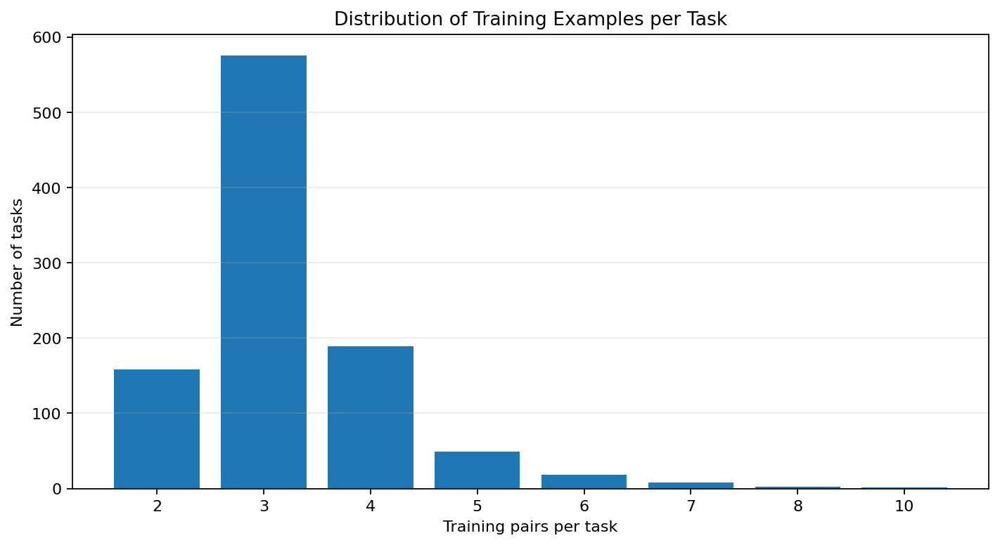
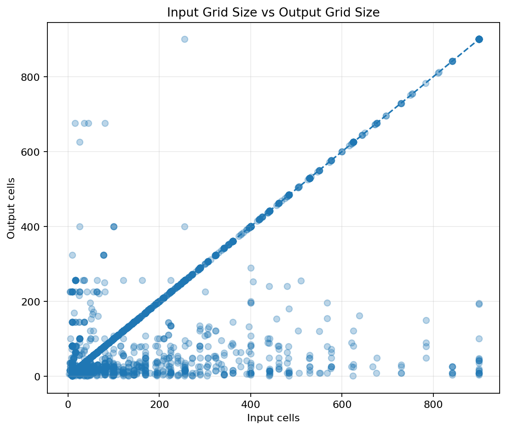
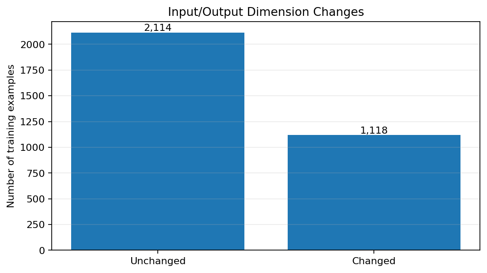
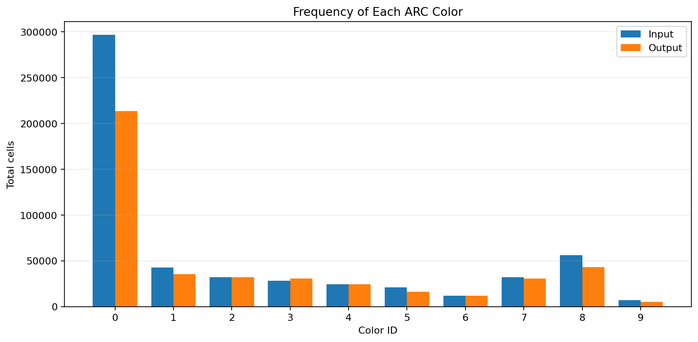
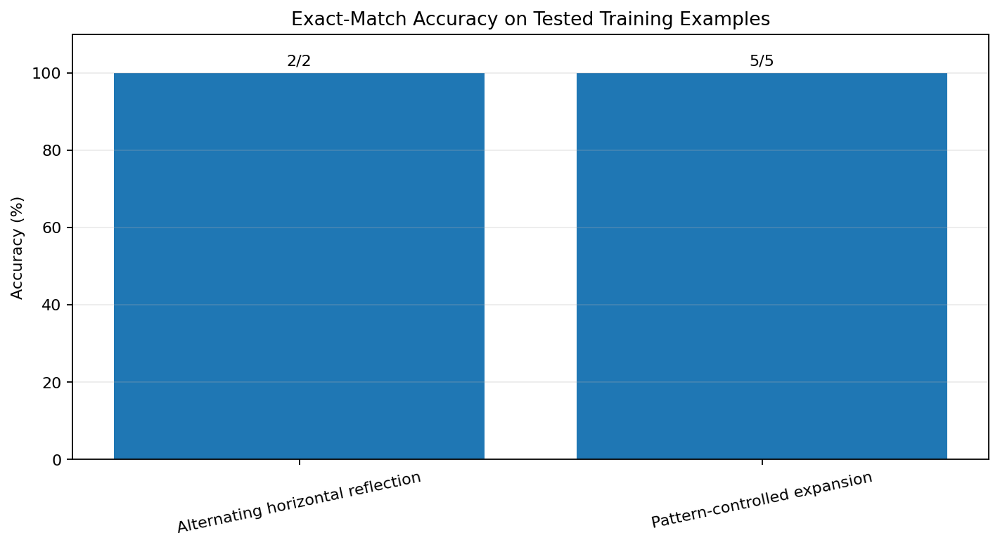

# ARC-Gis: Reasoning Experiments for ARC-AGI-2

**A research project exploring neural networks, Transformers, parameter-efficient fine-tuning, and rule-based reasoning for abstract visual puzzles.**

[](https://www.kaggle.com/competitions/arc-prize-2026-arc-agi-2) [](https://huggingface.co/) [](#proposed-hybrid-approach)

ARC-Gis investigates how AI systems can learn and apply transformations to small colored grids. The project combines exploratory data analysis, a pretrained language model, parameter-efficient fine-tuning experiments, and deterministic rule checks.

The central research question is:

> Can a hybrid system combine the learned representations of a neural network with explicit transformation rules to solve unfamiliar abstract grid puzzles more reliably?

This repository documents experiments and analysis. It does **not** claim that the current system solves ARC-AGI-2 generally or achieves a verified competition leaderboard score.

---

## Contents

* [1. Project overview](#1-project-overview)
* [2. What is ARC-AGI-2?](#2-what-is-arc-agi-2)
* [3. ANN vs. CNN vs. Transformer](#3-ann-vs-cnn-vs-transformer)
* [4. Types of Transformers](#4-types-of-transformers)
* [5. Real-world AI examples](#5-real-world-ai-examples)
* [6. Why use Qwen3?](#6-why-use-qwen3)
* [7. Proposed hybrid approach](#7-proposed-hybrid-approach)
* [8. Dataset analysis](#8-dataset-analysis)
* [9. Fine-tuning experiment](#9-fine-tuning-experiment)
* [10. Results and limitations](#10-results-and-limitations)
* [11. Figures and tables](#11-figures-and-tables)
* [12. Reproducibility](#12-reproducibility)
* [13. Roadmap](#13-roadmap)
* [14. References](#14-references)

---

## 1. Project overview

ARC-AGI-2 presents small visual puzzles in which a model must infer a transformation from a few input-output examples and apply it to a new input.

A puzzle may require the system to discover that a grid is being reflected, rotated, tiled, expanded, recolored, or transformed according to a more complex relationship.

This is different from ordinary image classification. The goal is not simply to recognize what is in an image. The system must infer a rule and apply it to a new case.

### Project goals

1. Analyze the ARC-AGI-2 training data and identify recurring structural patterns.
2. Investigate whether a pretrained language model can help represent and reason about grid transformations.
3. Measure the effect of fine-tuning on validation loss and exact-match generation.
4. Verify simple transformations with deterministic code.
5. Develop a hybrid system that combines learned representations with explicit rules.
6. Report failures and limitations rather than confusing training progress with general reasoning ability.

### Current research status

| Component                          | Current status                         |
| ---------------------------------- | -------------------------------------- |
| Training-data exploration          | Completed for the recorded analysis    |
| Qwen3 1.7B fine-tuning experiment  | Completed for the recorded run         |
| Validation-loss comparison         | Recorded                               |
| Exact-match generation evaluation  | Recorded; 0/32 in the evaluated sample |
| Selected deterministic rule checks | 7/7 selected examples passed           |
| Generalization to unseen ARC tasks | Not established                        |
| Official competition score         | Not established                        |
| Integrated hybrid solver           | Proposed research direction            |

---

## 2. What is ARC-AGI-2?

ARC stands for **Abstraction and Reasoning Corpus**. The benchmark is designed to test the ability to infer abstract rules from a small number of examples.

Each task typically contains training examples and one or more test inputs. A grid is a two-dimensional array of integer color identifiers. The integers represent colors, not quantities.

For example, a grid could be represented as:

```python
grid = [
    [0, 0, 0, 0],
    [0, 2, 0, 0],
    [0, 0, 0, 0],
    [0, 0, 0, 0],
]
```

Here, `0` represents one color and `2` another. The meaning of the colors depends on the puzzle.

A task supplies example transformations. The solver must infer the underlying relationship rather than simply copy an example.

### Why ARC is challenging

* **Few examples:** A task may provide only a small number of demonstrations.
* **Novel combinations:** Familiar operations can appear in unfamiliar combinations.
* **Changing dimensions:** Some transformations produce grids of different sizes.
* **Spatial reasoning:** The solver must understand object position, symmetry, shape, and relative location.
* **Rule induction:** It must infer what operation explains the examples.
* **Generalization:** The inferred rule must work on a test input that was not used to establish it.

A successful system needs more than fluent language generation. It needs reliable structured output and a way to check whether the proposed grid follows the inferred rule.

---

## 3. ANN vs. CNN vs. Transformer

These terms are related, but they are not interchangeable.

**ANN** means artificial neural network and is a broad category. A CNN is one kind of ANN. A Transformer is another neural-network architecture that uses attention mechanisms.

### Architecture comparison

| Property                     | ANN / MLP                                                  | CNN                                                                  | Transformer                                                                |
| ---------------------------- | ---------------------------------------------------------- | -------------------------------------------------------------------- | -------------------------------------------------------------------------- |
| Full name                    | Artificial neural network; MLP means multilayer perceptron | Convolutional neural network                                         | Transformer neural network                                                 |
| Main mechanism               | Layers of weighted connections and nonlinear activations   | Learned convolution filters                                          | Attention, feed-forward layers, and positional information                 |
| Typical strength             | General nonlinear mappings and compact prediction tasks    | Local visual patterns and spatial structure                          | Relationships between tokens or patches across a sequence                  |
| Typical input                | Feature vectors                                            | Images, grids, spatial signals                                       | Text tokens, image patches, audio tokens, or other sequences               |
| Spatial inductive bias       | Depends on input representation and architecture           | Strong local-neighborhood bias                                       | Depends on positional encoding, attention design, and input representation |
| Potential limitation for ARC | Flattening a grid may discard useful spatial structure     | May need substantial data or carefully designed reasoning mechanisms | Can be computationally expensive and may generate invalid grid outputs     |
| ARC-Gis role                 | Baseline for small feature-based experiments               | Candidate for grid-native visual processing                          | Candidate for learned pattern representations and reasoning                |

### 3.1 Artificial neural networks (ANNs)

An ANN consists of connected computational units, often arranged in layers. Each unit combines its inputs using learned weights, applies an activation function, and passes information to the next layer.

A common feed-forward ANN is the **multilayer perceptron (MLP)**.

An MLP could receive engineered features such as:

* Grid height and width
* Number of objects
* Number of colors
* Object positions
* Symmetry indicators
* Whether the input and output dimensions differ

It can learn relationships between these features and a target label or prediction.

**Advantage:** An MLP can be small, fast, and useful for structured features.

**Limitation:** A conventional MLP does not automatically understand that nearby grid cells are spatially related. A flattened grid also becomes sensitive to how its cells are ordered.

### 3.2 Convolutional neural networks (CNNs)

CNNs apply learned filters to local neighborhoods. Early layers can respond to simple patterns such as edges, corners, and repeated color arrangements. Deeper layers combine these local patterns into more complex features.

For ARC-style grids, a CNN could help detect:

* Repeated shapes
* Connected color regions
* Borders and corners
* Local motifs
* Repeated spatial patterns

**Advantage:** CNNs have a useful built-in bias toward local spatial patterns and can share filter weights across grid positions.

**Limitation:** Detecting a local pattern is not the same as discovering the complete transformation rule. A standard CNN may need additional mechanisms to handle long-range relationships, changing dimensions, or abstract multi-step transformations.

### 3.3 Transformers

Transformers use attention to determine which parts of a representation should influence other parts. In a language model, those parts are typically tokens. In a vision Transformer, they may be image patches or other visual representations.

For ARC-Gis, a grid could be encoded as:

* A sequence of cell tokens
* A sequence of row tokens
* Object-level tokens
* Structured tokens that describe colors, coordinates, and shapes

The representation matters: a language model does not automatically understand a grid just because the grid is written as text.

**Advantage:** Attention can model relationships between distant parts of the representation, and pretrained Transformers provide powerful learned representations.

**Limitation:** A Transformer may infer the wrong rule, produce malformed grids, or generate plausible-looking but incorrect outputs. Exact grid verification remains essential.

### 3.4 Which is best for ARC-AGI-2?

There is no universal winner.

* A **CNN** is a natural candidate when local spatial patterns dominate.
* An **MLP** can be an efficient baseline for engineered task features.
* A **Transformer** can represent more complex relationships, particularly when its input encoding and training objective suit the task.
* A **hybrid solver** can combine learned pattern recognition with explicit rule application and output verification.

The most useful comparison is empirical: evaluate each approach on the same task split, with the same output requirements and a clearly defined metric.

---

## 4. Types of Transformers

“Transformer” describes a family of architectures, not one specific model.

### 4.1 Encoder-only Transformers

**Example family:** BERT-style models.

An encoder processes an input representation and produces contextual representations. Encoder-only models are often used for classification, retrieval, semantic similarity, and feature extraction.

**Possible ARC role:** Encode a description of a grid or compare representations of task examples. A standard encoder does not directly provide a complete grid-generation solution without an appropriate output head or additional decoder.

### 4.2 Decoder-only Transformers

**Example families:** GPT-style models and many generative language models, including the Gemma decoder-only models described in Google's architecture documentation.

A decoder-only model predicts a sequence one token at a time, conditioned on the preceding context.

**Possible ARC role:** Serialize input-output demonstrations into a prompt and generate a candidate output grid.

This is relevant to ARC-Gis because the current experiment uses a pretrained generative language model. However, text generation alone does not guarantee valid or correct grid transformations.

### 4.3 Encoder-decoder Transformers

**Example family:** T5-style models; the original Transformer translation architecture is another example.

The encoder builds a representation of the input, while the decoder generates an output conditioned on that representation.

**Possible ARC role:** Encode the examples and generate a structured output grid. The model would still need an appropriate representation, training objective, and output validation.

### 4.4 Vision Transformers (ViTs)

Vision Transformers typically divide an image into patches, embed the patches, and process them with Transformer layers.

**Possible ARC role:** Process rendered grid images or learned cell embeddings.

A patch-based representation may be less natural than direct cell-level encoding for very small discrete grids. Experiments should compare image-based and symbolic representations instead of assuming that one is better.

### 4.5 Multimodal Transformers

Multimodal systems combine two or more data types, such as text, images, audio, and video.

A model may use separate encoders, shared representations, or specialized components to connect modalities.

**Possible ARC role:** Combine a visual grid representation with a textual explanation or symbolic representation of candidate rules.

### 4.6 Mixture-of-Experts (MoE) Transformers

MoE models contain multiple expert networks and use a routing mechanism to select which experts process a given input. The goal is to increase model capacity without activating every expert for every token.

**Possible ARC role:** A larger model could learn specialized patterns, but MoE architecture alone does not guarantee better abstract reasoning.

### 4.7 Efficient and specialized Transformer variants

Research also explores grouped-query attention, multi-query attention, local attention, recurrent mechanisms, quantization, and other efficiency techniques.

These methods address different issues, including memory use, inference speed, and long-sequence processing. They are not all separate model families; some are architectural components that can be combined.

**Key point:** Choosing a Transformer involves more than counting parameters. The input representation, attention design, training objective, fine-tuning data, inference method, and evaluation protocol all matter.

---

## 5. Real-world AI examples

Products and model architectures should be distinguished. A consumer assistant is usually a complete system made from multiple models, software components, services, and safety mechanisms.

| Example                     | What it is                                                  | Connection to neural networks and Transformers                                                                                                                            | Lesson for ARC-Gis                                                                      |
| --------------------------- | ----------------------------------------------------------- | ------------------------------------------------------------------------------------------------------------------------------------------------------------------------- | --------------------------------------------------------------------------------------- |
| Google Gemma                | A family of AI models with different sizes and capabilities | Includes Transformer-based language models and newer variants with different architectural and multimodal capabilities                                                    | Open-weight models can be adapted and evaluated for a specialized task                  |
| Google Gemini               | Google's broader family of AI models and services           | Includes models for generative and multimodal tasks                                                                                                                       | A model can combine different input modalities and capabilities                         |
| Amazon Alexa                | A voice-assistant product and ecosystem                     | Voice assistants can involve speech recognition, language understanding, dialogue management, tools, and generative models; the exact stack varies by product and version | A capable assistant is a system, not merely one neural network                          |
| Apple Siri                  | Apple's voice-assistant product                             | Siri's capabilities depend on Apple's software and underlying model systems; the implementation can evolve over time                                                      | Integrating a model into a reliable application requires more than generating an answer |
| CNN-based vision systems    | A class of computer-vision systems                          | Use convolutional layers to learn visual features                                                                                                                         | Spatially structured data can benefit from architecture-specific inductive biases       |
| BERT-style language systems | Encoder-based language models                               | Build contextual representations for understanding and classification tasks                                                                                               | Encoding and comparing examples can be a separate component from generating an answer   |
| GPT-style language systems  | Generative language models                                  | Commonly use decoder-only Transformers to generate sequences                                                                                                              | Candidate generation needs a strict output format and an independent correctness check  |

### 5.1 Google Gemma

Gemma is a family of models released for developers to adapt and deploy. Model variants differ in size, input modalities, efficiency, and intended use. Some variants support text alone, while others support visual or audio inputs.

Official model documentation: [Google Gemma models](https://ai.google.dev/gemma/docs).

For ARC-Gis, Gemma could be evaluated as an alternative to Qwen3. A fair comparison would use the same task split, grid encoding, fine-tuning budget, decoding settings, and exact-match evaluation.

The fact that a model comes from Google—or is related to research used in other Google models—does not itself demonstrate that it will perform better on ARC.

### 5.2 Amazon Alexa

Alexa is a product, not the name of one particular neural-network architecture. A voice assistant may combine speech-to-text, language understanding, dialogue state, retrieval, action execution, and text-to-speech. Product implementations change over time.

For ARC-Gis, the useful architectural lesson is that a multi-stage system can be more dependable than a single component expected to perform every operation. A rule selector, grid transformer, and output validator can each have a specific responsibility.

### 5.3 Apple Siri

Siri is also a product and system, rather than a single architecture. Its underlying capabilities and model integrations can change between software generations.

Apple's published work on its foundation models describes a family of models used for Apple Intelligence features. See [Apple Machine Learning Research](https://machinelearning.apple.com/research/introducing-third-generation-of-apple-foundation-models).

For ARC-Gis, the lesson is to separate the model from the surrounding application. A system can use a learned model to interpret a task and then use deterministic software to execute and verify a transformation.

### 5.4 The broader lesson

A useful AI application often contains several distinct layers:

1. Input processing
2. Representation or encoding
3. Learned inference
4. Tool use or deterministic operations
5. Output validation
6. Error handling and evaluation

ARC-Gis explores a similar division of responsibilities for abstract grid puzzles. The proposed architecture is a research hypothesis, not a claim that the project already has the reliability or capabilities of commercial assistants.

---

## 6. Why use Qwen3?

The recorded experiment used the Qwen3 1.7B base model available in the Kaggle environment.

Recorded model configuration:

* Model family: Qwen3
* Parameter scale: 1.7 billion
* Transformer layers: 28
* Hidden size: 2,048
* Experiment environment: Kaggle notebook with a Tesla T4 GPU

These details describe the model configuration and recorded environment, not a guarantee that every model operation or evaluation was performed under identical conditions.

### Why use a pretrained language model?

A pretrained model provides learned representations before task-specific fine-tuning. Fine-tuning can then adapt the model to a specialized data format or task.

Potential benefits include:

* Learning to represent structured input-output examples
* Exploiting pretrained sequence-processing capabilities
* Testing whether task-specific fine-tuning improves the training objective
* Comparing generated predictions before and after adaptation

### Why this is not automatically enough

A language model trained on text is not automatically a symbolic reasoning engine. A grid serialized into text can be difficult to interpret, particularly when the output must be an exact two-dimensional array.

Potential failure modes include:

* Incorrectly identifying the transformation
* Memorizing patterns without generalizing
* Producing invalid or incomplete grids
* Returning the correct colors in the wrong positions
* Generating a plausible explanation that does not match the output
* Failing when output dimensions change

For this reason, ARC-Gis tracks validation loss separately from exact-match output quality.

---

## 7. Proposed hybrid approach

The proposed architecture separates pattern inference from rule execution and verification.

It is a design direction for future work, not a statement that every component has already been implemented or benchmarked.

### Processing stages

**Stage 1 — Parse the task**

Read the input-output demonstrations and convert each grid into a consistent internal representation.

**Stage 2 — Extract features**

Calculate properties such as dimensions, color counts, connected components, symmetry, repeated patterns, and object locations.

**Stage 3 — Propose candidate rules**

Use a learned model, deterministic detectors, or both to propose transformations that may explain the demonstrations.

**Stage 4 — Test the candidates**

Apply each candidate rule to the known examples. Reject candidates that fail to reproduce the demonstrated outputs.

**Stage 5 — Generate the test output**

Apply the selected rule to the unseen input grid.

**Stage 6 — Validate the result**

Check output dimensions, valid color identifiers, rectangular shape, and consistency with the selected transformation.

**Stage 7 — Record the evidence**

Store the prediction, the chosen rule, validation results, and any failure reason.

### Candidate rule families

| Rule family                | Example operation                                 | Potential verification                       |
| -------------------------- | ------------------------------------------------- | -------------------------------------------- |
| Reflection                 | Horizontal or vertical mirror                     | Compare with a reflected grid                |
| Rotation                   | Rotate by 90°, 180°, or 270°                      | Compare with a rotated grid                  |
| Recoloring                 | Replace one color with another                    | Check all changed and unchanged cells        |
| Tiling                     | Repeat a pattern                                  | Check periodic structure and dimensions      |
| Expansion                  | Increase grid dimensions according to a pattern   | Verify dimensions and cell mapping           |
| Object movement            | Translate an object                               | Verify shape preservation and displacement   |
| Symmetry completion        | Fill cells to create symmetry                     | Verify the symmetry condition                |
| Conditional transformation | Apply different operations depending on a pattern | Verify the condition and resulting operation |

### Why combine learned and deterministic methods?

A learned model can propose a rule when the pattern is difficult to recognize with a fixed detector. Deterministic code can apply a known rule precisely and test whether it explains the examples.

Neither component eliminates all failure modes. A rule library may lack the right operation, while a model may propose an incorrect rule that happens to fit a few examples.

The system should therefore retain multiple candidates when appropriate, test them against every demonstration, and evaluate generalization on held-out tasks.

---

## 8. Dataset analysis

The recorded exploration examined the ARC-AGI-2 training tasks and their input-output examples.

### Recorded dataset observations

* Training tasks analyzed: **1,000**
* Training input-output pairs: **3,232**
* Tasks with more than one training pair: **1,000**
* Tasks containing at least one dimension-changing example: **320**
* Share of tasks with at least one dimension-changing example: **32%**

A dimension-changing task is one in which an input grid and its corresponding output grid differ in height or width in at least one example. This observation does not establish that all such tasks require the same type of rule.

### Why these measurements matter

**Grid dimensions:** Changes in height and width can distinguish a simple cell-wise transformation from an expansion, cropping, or tiling operation.

**Color frequency:** Color distributions can help identify rare colors, background colors, and potential object markers. Frequency alone is not sufficient to identify their semantic role.

**Training-pair distribution:** Tasks with different numbers of examples provide different amounts of evidence for inferring a rule.

**Transformation signatures:** Dimension changes, color changes, object counts, and symmetry indicators can help group tasks by observable properties.

These are descriptive features. They should not be confused with verified solutions or a complete taxonomy of ARC reasoning.

---

## 9. Fine-tuning experiment

The recorded experiment fine-tuned Qwen3 1.7B and compared the baseline and fine-tuned validation losses.

### Validation-loss result

| Metric                            |      Recorded value |
| --------------------------------- | ------------------: |
| Baseline validation loss          |              0.6996 |
| Fine-tuned validation loss        |              0.4407 |
| Relative reduction                | Approximately 37.0% |
| Recorded optimizer steps          |                 429 |
| Exact-match generation evaluation |                0/32 |

The relative loss reduction is calculated as:

`(0.6996 - 0.4407) / 0.6996 × 100 ≈ 37.0%`

### Interpretation

The validation loss decreased in the recorded experiment. This indicates that the fine-tuned model performed better according to that loss metric on the evaluated validation data.

However, **lower validation loss does not necessarily mean better ARC puzzle solving**. A model may learn to predict the training format more effectively while still failing to infer or apply the correct transformation.

The recorded exact-match generation result was 0 out of 32 evaluated cases. This is an important negative result: the loss improvement did not translate into a correct output in that particular generation evaluation.

The 32-case result is a limited sample, not a definitive estimate of performance on the entire competition.

### LoRA and parameter-efficient fine-tuning

Low-Rank Adaptation (LoRA) is a fine-tuning technique that adds trainable low-rank matrices to selected model weight transformations while keeping the original weights frozen, where configured.

A common conceptual representation is:

`W_new = W_base + ΔW`

`ΔW = B × A`

Here, `A` and `B` are trainable low-rank matrices. The technique can reduce the number of trainable parameters relative to updating every base-model weight.

LoRA is a training method, not a reasoning algorithm. It can make adapting a large model more resource-efficient, but it cannot guarantee that the adapted model learns a generalizable ARC transformation strategy.

The exact LoRA rank, scaling factor, target modules, and other configuration values should be taken from the actual notebook configuration. They are not asserted here because those values were not verified in the recorded project summary.

Reference: [LoRA — Low-Rank Adaptation of Large Language Models](https://arxiv.org/abs/2106.09685).

---

## 10. Results and limitations

### Selected deterministic rule checks

Two selected tasks were tested with deterministic rules:

| Task ID    | Tested transformation             | Selected examples passed |
| ---------- | --------------------------------- | -----------------------: |
| `00576224` | Alternating horizontal reflection |                      2/2 |
| `007bbfb7` | Pattern-controlled expansion      |                      5/5 |
| **Total**  | **Selected rule checks**          |                  **7/7** |

The recorded predictions are stored in `Tables/rule_test_predictions.json`.

The prediction file uses two-dimensional integer grids with color identifiers in the range 0–9. Its rectangular-grid structure was checked in the recorded integrity audit.

### What these results establish

* The two selected rule implementations reproduced their selected examples.
* The prediction file was checked for basic structural integrity.
* The fine-tuning experiment reduced validation loss.
* The evaluated generation sample did not achieve an exact match.

### What these results do not establish

* That the system generalizes to unseen tasks
* That all ARC-AGI-2 transformation types are covered
* That 7/7 selected rule checks represent 100% ARC accuracy
* That the model has learned a general abstract reasoning algorithm
* That the project has achieved an official competition score

The selected rule checks are a narrow functional test. If the rules were selected after examining the examples, their results should not be presented as independent held-out accuracy.

### Important next evaluation

A stronger experiment should use held-out tasks that were not used to develop the rules or tune the model. It should report:

* Number of tasks and examples evaluated
* Exact-match task accuracy
* Exact-match grid accuracy, if also measured
* Invalid-output rate
* Results split by transformation family
* Baseline versus fine-tuned performance
* Number of attempts per task
* Compute budget and inference settings
* Whether any task examples were used during development

This would make it possible to determine whether a new method genuinely improves generalization.

---

## 11. Figures and tables

**Rendering policy:** Each figure is embedded on its own line and separated from the next figure by a blank line. No figure is placed inside a multi-column table, HTML layout, or side-by-side image block. This keeps the GitHub README simple and reduces the risk of overlapping layouts.

The primary figures are embedded below. Confirm that each image exists at the exact case-sensitive path shown.

### Figure 1 — Training-pair distribution



This plot summarizes how many training examples are provided for different tasks.

### Figure 2 — Input and output grid sizes



This plot supports analysis of grid dimensions and possible structural transformations.

### Figure 3 — Dimension changes



This figure summarizes changes in grid dimensions between input and output examples.

### Figure 4 — Color frequency



Color-frequency patterns can support exploratory analysis, but frequency alone does not identify the rule for a task.

### Figure 5 — Verified rule accuracy



This figure concerns selected rule checks, not overall competition accuracy.

### Additional figures

The remaining plots are available as separate files. Open each one individually to avoid layout issues in the README.

* [Training loss](figures/training_loss.png)
* [Validation loss](figures/validation_loss.png)
* [Generation quality](figures/generation_quality.png)
* [Rule verification accuracy](figures/rule_verification_accuracy.png)
* [Submission diagnostics](figures/submission_diagnostics.png)
* [Transformation signature heatmap](figures/transformation_signature_heatmap_100.png)

### Data tables

The `Tables/` directory contains supporting data, including:

* `archive_manifest.csv`
* `color_frequency.csv`
* `cpu_prediction_integrity_audit.csv`
* `dimension_change_counts.csv`
* `eda_summary.csv`
* `example_level_eda.csv`
* `example_level_features.csv`
* `metrics.csv`
* `rule_test_predictions.json`
* `rule_verification_results.csv`
* `task_level_features.csv`
* `task_rule_analysis.csv`
* `task_summary.csv`
* `training_loss_points.csv`

These files should be interpreted according to their contents and evaluation protocols. Their presence does not imply that all recorded analyses are independent test results.

---

## 12. Reproducibility

The project includes a Kaggle notebook:

`arc-agi-2-on-a-t4-lora-pre-fine-tuning-test-time.ipynb`

The recorded model checkpoint path in the Kaggle environment was:

`/kaggle/input/models/qwen-lm/qwen-3/transformers/1.7b-base/1`

Paths under `/kaggle/input/` are specific to the Kaggle runtime and may not work on another computer. A reproducible release should document how the dataset and model checkpoint are obtained and identify the exact versions used.

### Suggested reproduction checklist

1. Open the notebook in the intended Kaggle environment.
2. Confirm that the required dataset and model checkpoint are available.
3. Record package versions and accelerator information.
4. Run data analysis and save the generated tables and plots.
5. Run fine-tuning using the notebook's documented configuration.
6. Evaluate the baseline and fine-tuned models using the same validation protocol.
7. Run generation evaluation with the same decoding settings.
8. Save predictions and validate output shape and color identifiers.
9. Report failures, invalid outputs, and exact-match results.
10. Verify that the README's reported values match the saved artifacts.

For future runs, preserve random seeds, task splits, model configuration, and evaluation settings wherever possible.

---

## 13. Roadmap

### Phase 1 — Reliable baselines

* [x] Explore the training tasks and example counts.
* [x] Analyze grid sizes, color frequencies, and dimension changes.
* [x] Record a pretrained-model fine-tuning experiment.
* [x] Run selected deterministic rule checks.
* [ ] Publish a clearly defined held-out task split.
* [ ] Add baseline exact-match evaluations with reproducible settings.

### Phase 2 — Better representations

* [ ] Compare raw text serialization with explicit coordinate and object representations.
* [ ] Test cell-level, row-level, and object-level tokenization.
* [ ] Build a compact MLP baseline using engineered task features.
* [ ] Build a CNN baseline for grid-native spatial processing.
* [ ] Compare Transformer variants under a shared evaluation protocol.

### Phase 3 — Hybrid rule system

* [ ] Implement reusable transformations for reflection, rotation, recoloring, and tiling.
* [ ] Verify candidate rules against every training example in a task.
* [ ] Rank multiple valid candidate rules rather than selecting the first match.
* [ ] Add dimension and color constraints to output validation.
* [ ] Record why each candidate was accepted or rejected.

### Phase 4 — Generalization and evaluation

* [ ] Evaluate on tasks held out from rule development.
* [ ] Report exact-match accuracy by task and transformation family.
* [ ] Measure invalid-output rate and inference cost.
* [ ] Test whether fine-tuning improves exact-match accuracy, not only loss.
* [ ] Document the final evaluation protocol and any competition submission results.

---

## 14. References

1. **ARC-AGI-2 competition:** [Kaggle competition page](https://www.kaggle.com/competitions/arc-prize-2026-arc-agi-2)
2. **ARC-AGI-2 dataset and resources:** [ARC Prize GitHub repository](https://github.com/arcprize/ARC-AGI-2)
3. **On the Measure of Intelligence:** François Chollet, [arXiv:1911.01547](https://arxiv.org/abs/1911.01547)
4. **Attention Is All You Need:** Vaswani et al., [arXiv:1706.03762](https://arxiv.org/abs/1706.03762)
5. **LoRA: Low-Rank Adaptation of Large Language Models:** Hu et al., [arXiv:2106.09685](https://arxiv.org/abs/2106.09685)
6. **Gemma model documentation:** [Google AI for Developers](https://ai.google.dev/gemma/docs)
7. **Transformer overview:** [Google for Developers](https://developers.google.com/machine-learning/crash-course/llm/transformers)
8. **Apple Foundation Models research:** [Apple Machine Learning Research](https://machinelearning.apple.com/research/introducing-third-generation-of-apple-foundation-models)

---

## Final note

ARC-Gis is an experimental investigation into the relationship between learned neural representations and explicit symbolic transformations.

The current evidence supports the narrower conclusion that the recorded fine-tuning run improved validation loss, while the evaluated generation sample did not produce an exact match and two selected deterministic rule checks passed their tested examples.

The next meaningful milestone is not simply a larger model or a lower loss. It is a reproducible improvement in exact-match performance on tasks that were not used to design the solver.
