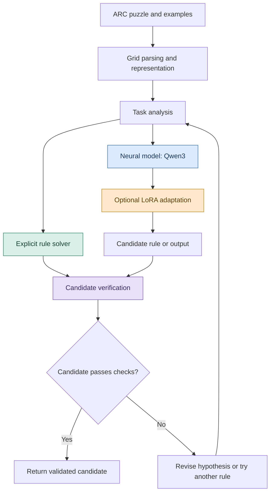
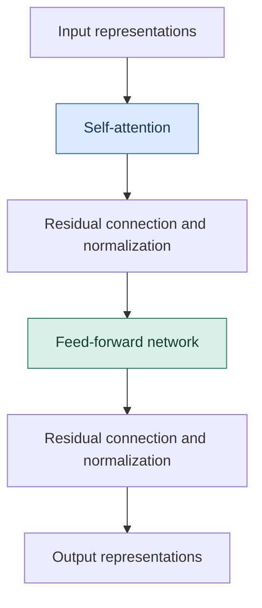
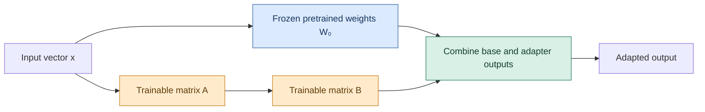
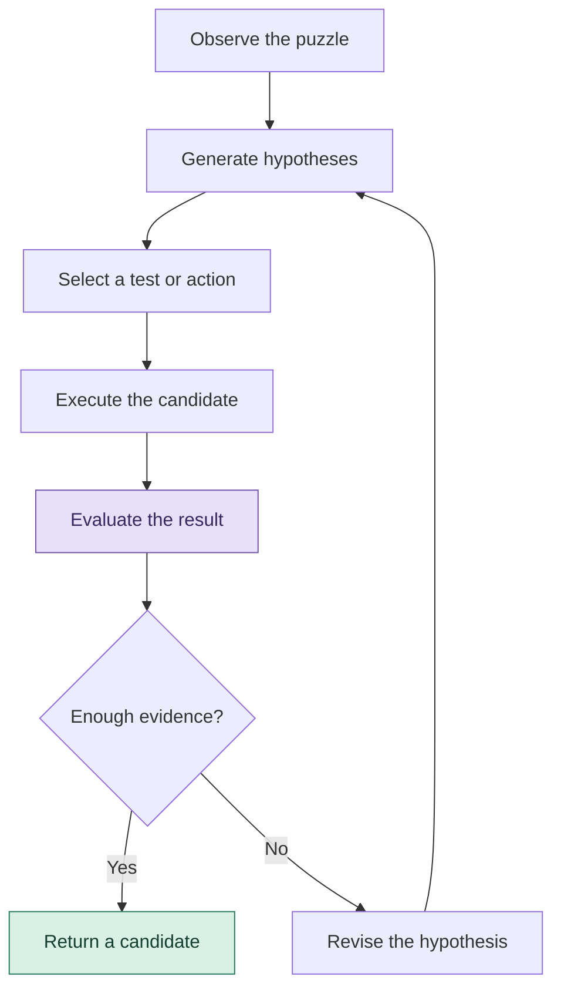

# ARC-Gis: Building AI That Learns to Reason

### From visual pattern recognition to rule discovery, adaptive computation, and generalization

> **Can an AI discover a new rule from a handful of examples—and apply it correctly to a puzzle it has never seen before?**

[GitHub Repository](https://github.com/ut1776/arc-agi-2-reasoning) · [ARC-AGI-2 Competition](https://www.kaggle.com/competitions/arc-prize-2026-arc-agi-2) · [ARC Prize Dataset](https://github.com/arcprize/ARC-AGI-2)

---

## The big idea

Most modern AI systems learn statistical patterns from large datasets. But recognizing a familiar pattern is not the same as discovering a rule, testing a hypothesis, and applying that rule to an unfamiliar problem.

**ARC-Gis explores how neural networks and explicit, testable rules might work together to solve abstract visual reasoning problems.**

The project investigates two complementary approaches:

* **Neural models:** experimenting with Qwen3, a pretrained transformer language model, and parameter-efficient fine-tuning using Low-Rank Adaptation (LoRA).
* **Explicit rule reasoning:** analyzing colored grids, testing candidate transformations, and verifying whether proposed rules reproduce observed examples.

The long-term ambition is to investigate whether combining learned models, structured representations, and systematic verification can improve generalization on ARC-AGI-2.

The aspirational target is **85% task accuracy**. This is a research goal, not a result achieved by the experiments documented here.

> **Central research question:** Can we combine the flexibility of neural networks with the precision and verifiability of explicit computation to build more reliable reasoning systems?

## 1. Why ARC-AGI-2 matters

The Abstraction and Reasoning Corpus (ARC) is designed to evaluate a particular challenge: learning a transformation from a small number of input-output examples and applying it to a new input.

Each puzzle consists of colored grids. The solver must infer the relationship between the examples without being given the underlying rule.

A puzzle might require the system to:

* Reflect a shape across an axis.
* Detect an object and move it.
* Identify a repeating pattern.
* Expand a grid according to a spatial rule.
* Recolor objects based on their relationships.
* Change output dimensions according to a discovered transformation.

### A simple example

The following is an illustrative grid transformation, not an official competition task. A single colored cell moves to the vertically reflected position.

**Input**

```text
0 0 0 0
0 2 0 0
0 0 0 0
0 0 0 0
```

**Output**

```text
0 0 0 0
0 0 0 0
0 2 0 0
0 0 0 0
```

The challenge in a real ARC puzzle is to infer the correct transformation from multiple demonstrations, then apply it to a new grid. A system that merely memorizes training examples will not necessarily generalize.

| Conventional pattern recognition                      | ARC-style reasoning                                   |
| ----------------------------------------------------- | ----------------------------------------------------- |
| Recognizes familiar patterns                          | Infers an unknown transformation                      |
| Often learns from many examples                       | Must often learn from a few demonstrations            |
| Predicts likely outputs                               | Must produce the correct structured output            |
| Can exploit familiar statistical associations         | Must handle unfamiliar combinations                   |
| May conceal brittle behavior behind aggregate metrics | Requires careful testing of complete grid predictions |

ARC-AGI-2 is not a complete measure of intelligence. It is a demanding benchmark for investigating abstraction and generalization.

Further reading: [ARC-AGI-2](https://www.kaggle.com/competitions/arc-prize-2026-arc-agi-2) · [On the Measure of Intelligence](https://arxiv.org/abs/1911.01547).

---

## 2. Proposed ARC-Gis architecture

ARC-Gis is a research project, not a new foundation model. Its current work includes dataset analysis, selected explicit rule checks, and a Qwen3 fine-tuning experiment.

The following diagram illustrates a **proposed hybrid architecture**. It should not be interpreted as evidence that every component or feedback loop is already implemented.



### What the components mean

**Grid parser:** Converts a puzzle into a structured representation. Each cell has a discrete color value, commonly represented by an integer from 0 to 9.

**Task analysis:** Extracts useful properties such as grid dimensions, color frequencies, object arrangements, and changes between examples.

**Explicit rule solver:** Tests candidate operations such as reflection, repetition, recoloring, or pattern-controlled expansion.

**Neural model:** Uses learned representations to generate candidate explanations, transformations, or outputs. These can be useful but may be incorrect.

**Candidate verification:** Checks grid structure and whether a proposed transformation reproduces the observed examples. Passing these checks does not prove that the rule will generalize to an unseen task.

**Search and revision:** A future system could use failed checks to guide additional attempts. The benefit of such an iterative process must be measured experimentally.

---

## 3. Transformers, explained simply

A transformer is a neural network architecture introduced in the paper [Attention Is All You Need](https://arxiv.org/abs/1706.03762).

Transformers are widely used in language models because they can represent relationships between different elements in a sequence.

Imagine the word “bank.” In “deposit money at the bank,” the surrounding words suggest a financial institution. In “sit by the river bank,” they suggest the edge of a river.

**Attention** allows a transformer to weigh relationships between elements when constructing their representations.

For ARC puzzles, the analogous challenge is determining which cells, objects, colors, and spatial relationships are relevant to the transformation.

### Inside a transformer block



* **Representations:** Numerical vectors encoding information about input tokens.
* **Self-attention:** Calculates how strongly different elements should influence one another.
* **Feed-forward network:** Transforms the representation at each position.
* **Residual connections and normalization:** Help information flow through the network and support stable training.

A transformer stacks multiple blocks. Its architecture does not automatically guarantee logical reasoning; its behavior depends on the learned parameters, training data, input representation, and inference procedure.

### Why Qwen3?

The project uses the Qwen3 1.7B base checkpoint available in the Kaggle environment.

The inspected model configuration reported:

| Property            | Recorded value                                        |
| ------------------- | ----------------------------------------------------- |
| Model family        | Qwen3                                                 |
| Checkpoint          | 1.7B base                                             |
| Transformer layers  | 28                                                    |
| Hidden dimension    | 2,048                                                 |
| Experiment hardware | Tesla T4 GPU; approximately 15 GB reported GPU memory |

These details refer to the inspected checkpoint and experimental environment, not every Qwen3 model variant.

Qwen3 provides a pretrained neural model with which to investigate whether fine-tuning can improve the generation of structured ARC outputs.

Reference: [Qwen3 Technical Report](https://arxiv.org/abs/2505.09388).

---

## 4. LoRA: adapting a large model with a small number of parameters

Fine-tuning adapts a pretrained model using additional training data. Updating every parameter can require substantial memory and computation.

**Low-Rank Adaptation (LoRA)** reduces the number of trainable parameters by freezing selected pretrained weights and learning small additional matrices.

### LoRA architecture

The following diagram is a conceptual schematic of the data flow, not a literal rendering of Qwen3's internal hardware or an actual 3D model.



Think of the pretrained model as a large machine that already contains learned capabilities. Instead of retraining all its internal parameters, LoRA adds a smaller trainable adjustment to selected layers.

The original weights remain frozen in the adapted layers; the LoRA matrices are trainable.

### The mathematics

Let \(W_0\) be a pretrained weight matrix. LoRA represents its effective weights as:

$$
W = W_0 + \Delta W
$$

The weight update is represented using two smaller matrices:

$$
\Delta W = BA
$$

For a base matrix of dimensions \(d_{\text{out}}\times d_{\text{in}}\), a common configuration uses:

$$
A \in \mathbb{R}^{r\times d_{\text{in}}}
$$

$$
B \in \mathbb{R}^{d_{\text{out}}\times r}
$$

Here, \(r\) is the adapter rank. The additional trainable parameter count is:

$$
N_{\text{LoRA}} = r(d_{\text{in}}+d_{\text{out}})
$$

By comparison, updating the full weight matrix requires:

$$
N_{\text{full}} = d_{\text{in}}d_{\text{out}}
$$

When \(r\) is sufficiently small, the adapter can require substantially fewer trainable parameters.

The original LoRA formulation commonly uses a scaling factor:

$$
W = W_0 + \frac{\alpha}{r}BA
$$

where \(\alpha\) is a scaling hyperparameter.

The exact rank, scaling factor, and target modules depend on the training configuration. This README does not assume values that have not been verified from the notebook.

### Why use LoRA?

* Fewer trainable parameters than full fine-tuning.
* Potentially lower training memory requirements.
* A practical way to experiment with task-specific adaptations.
* The ability to keep the pretrained base model unchanged while saving an adapter separately.

### What LoRA does not do

LoRA is a parameter-efficient fine-tuning method, not a reasoning algorithm. It does not guarantee abstract reasoning, correct grid generation, or generalization to unfamiliar tasks.

Reference: [LoRA: Low-Rank Adaptation of Large Language Models](https://arxiv.org/abs/2106.09685).

---

## 5. Is ARC-Gis generative AI, a reasoning system, or an AI agent?

These terms describe different properties and are not mutually exclusive.

| Term             | Meaning                                                                         | Relationship to ARC-Gis                                                       |
| ---------------- | ------------------------------------------------------------------------------- | ----------------------------------------------------------------------------- |
| Generative AI    | Produces new content, including text or structured outputs                      | Qwen3 can generate candidate explanations or grids                            |
| Transformer      | A neural network architecture                                                   | Qwen3 uses a transformer                                                      |
| Fine-tuned model | A pretrained model adapted through additional training                          | The Qwen3 experiment investigates this                                        |
| LoRA             | A parameter-efficient fine-tuning method                                        | Trains small adapter matrices for selected layers                             |
| Reasoning system | Uses intermediate operations, hypotheses, or rules to derive an answer          | Explicit rule testing and candidate verification explore this                 |
| AI agent         | Observes a situation, chooses actions, and uses feedback to pursue an objective | A future ARC-Gis system could iteratively propose, test, and revise solutions |
| Hybrid AI        | Combines approaches such as neural networks and symbolic computation            | This is the main architectural direction being investigated                   |

### Is ARC-Gis an AI agent today?

The careful answer is that **ARC-Gis is currently a reasoning-system research project exploring agent-like behavior**. Having a language model and a rule checker does not, by itself, establish a fully autonomous agent.

A more complete agent could follow this loop:



This is a proposed workflow, not a claim that the complete loop has already been implemented.

### Types of AI agents

* **Reactive agents:** Choose actions based on the current observation.
* **Model-based agents:** Maintain an internal representation of the situation.
* **Goal-based agents:** Select actions according to a desired outcome.
* **Planning agents:** Search for sequences of actions that achieve a goal.
* **Learning agents:** Use experience or feedback to improve behavior.
* **Tool-using agents:** Execute external programs or call services as part of their workflow.

These are useful conceptual categories rather than one universally accepted taxonomy. A future ARC-Gis system could combine several—for example, a neural hypothesis generator, a search procedure, and a deterministic verification tool.

---

## 6. Experimental results so far

The repository distinguishes measured results from hypotheses and proposed architecture.

### Dataset analysis

The recorded analysis of the training challenges found:

| Dataset property                                   | Observed value |
| -------------------------------------------------- | -------------: |
| Training tasks                                     |          1,000 |
| Input-output training pairs                        |          3,232 |
| Tasks with at least one dimension-changing example |            320 |
| Share of tasks with dimension-changing examples    |            32% |

These are descriptive statistics of the analyzed training data, not measures of model reasoning performance.

### Qwen3 fine-tuning

| Metric                                                       |     Recorded result |
| ------------------------------------------------------------ | ------------------: |
| Optimizer steps                                              |                 429 |
| Baseline validation loss                                     |              0.6996 |
| Fine-tuned validation loss                                   |              0.4407 |
| Relative validation-loss reduction                           | Approximately 37.0% |
| Exact-match generation on the recorded 32-example evaluation |                0/32 |

The relative reduction in validation loss is:

$$
\frac{0.6996-0.4407}{0.6996}\times100
\approx 37.0\%
$$

**Interpretation:** validation loss decreased, but the model did not achieve an exact-match output on the recorded 32-example generation evaluation.

These metrics measure different things. Validation loss measures the model's probability assignments to target tokens under a particular evaluation setup. Exact-match evaluation measures whether the complete generated output matches the expected grid.

The 0/32 result is not an official competition score, nor does it prove that every possible configuration of Qwen3 will fail. It does show that this experiment has not yet demonstrated successful exact-match generation on that evaluation.

### Explicit rule verification

Two selected training tasks were tested with explicit transformations:

| Task ID      | Candidate rule                    | Training examples matched |
| ------------ | --------------------------------- | ------------------------: |
| `00576224`   | Alternating horizontal reflection |                       2/2 |
| `007bbfb7`   | Pattern-controlled expansion      |                       5/5 |
| **Combined** | **Two selected tasks**            |                   **7/7** |

These results show that the implementations reproduce the selected training examples. They do not establish broad generalization, an end-to-end solver, or official benchmark accuracy.

### What the experiments teach us

1. Lower training loss does not guarantee exact-match grid generation.
2. Structured output representation and decoding are essential.
3. Explicit transformations can be tested independently.
4. Matching training examples does not prove that a rule is uniquely correct or will generalize.
5. Progress should be measured on a clearly defined held-out evaluation, not inferred from training metrics alone.

---

## 7. Figures: dataset and experiment diagnostics

The following images are stored in the repository's `figures/` directory.

### Dataset structure

**Training-pair distribution**


**Input and output grid sizes**


**Dimension changes**


**Color frequencies**


### Training behavior

**Training loss**


**Validation loss**


**Generation quality**


### Rule verification and diagnostics

**Verified-rule accuracy**


**Rule-verification accuracy**


**Submission diagnostics**


**Transformation-signature heatmap**


The plots should be interpreted using their underlying data and evaluation definitions. A figure title or metric alone does not establish general reasoning capability.

---

## 8. Tables and reproducibility artifacts

The `Tables/` directory contains the recorded analysis and evaluation artifacts.

| Artifact                                                                          | Purpose                               |
| --------------------------------------------------------------------------------- | ------------------------------------- |
| [`archive_manifest.csv`](Tables/archive_manifest.csv)                             | Dataset and archive inventory         |
| [`color_frequency.csv`](Tables/color_frequency.csv)                               | Color-frequency statistics            |
| [`cpu_prediction_integrity_audit.csv`](Tables/cpu_prediction_integrity_audit.csv) | Structural checks for CPU predictions |
| [`dimension_change_counts.csv`](Tables/dimension_change_counts.csv)               | Dimension-change statistics           |
| [`eda_summary.csv`](Tables/eda_summary.csv)                                       | Exploratory data analysis summary     |
| [`example_level_eda.csv`](Tables/example_level_eda.csv)                           | Example-level analysis                |
| [`example_level_features.csv`](Tables/example_level_features.csv)                 | Features extracted from examples      |
| [`metrics.csv`](Tables/metrics.csv)                                               | Recorded experiment metrics           |
| [`rule_test_predictions.json`](Tables/rule_test_predictions.json)                 | Selected rule-based predictions       |
| [`rule_verification_results.csv`](Tables/rule_verification_results.csv)           | Rule-check results                    |
| [`task_level_features.csv`](Tables/task_level_features.csv)                       | Task-level features                   |
| [`task_rule_analysis.csv`](Tables/task_rule_analysis.csv)                         | Task-level rule analysis              |
| [`task_summary.csv`](Tables/task_summary.csv)                                     | Task summary                          |
| [`training_loss_points.csv`](Tables/training_loss_points.csv)                     | Recorded training-loss points         |

The repository also contains the experiment notebook:

[`arc-agi-2-on-a-t4-lora-pre-fine-tuning-test-time.ipynb`](arc-agi-2-on-a-t4-lora-pre-fine-tuning-test-time.ipynb)

For stronger reproducibility, future revisions should document dependency versions, random seeds, the exact training configuration, dataset version, evaluation split, and inference settings. Access to Kaggle data or model checkpoints may be required to rerun the notebook.

---

## 9. How should success be measured?

No single metric captures all aspects of reasoning-system performance.

### Exact-match accuracy

For \(N\) evaluated examples, let \(\hat{y}_i\) be the predicted output and \(y_i\) the reference output.

$$
\operatorname{Accuracy}
=
\frac{1}{N}
\sum_{i=1}^{N}
\mathbf{1}[\hat{y}_i=y_i]
$$

The indicator is 1 when the complete predicted grid matches the reference and 0 otherwise.

### Cross-entropy loss

For a model generating a sequence of target tokens, the average cross-entropy loss can be written as:

$$
\mathcal{L}
=
-\frac{1}{T}
\sum_{t=1}^{T}
\log p_\theta(y_t\mid y_{<t},x)
$$

Here, \(x\) is the input representation, \(y_t\) is the target token at position \(t\), \(y_{<t}\) represents earlier target tokens, and \(T\) is the target sequence length.

This objective rewards assigning higher probability to the correct target tokens. It does not guarantee that the complete decoded grid will be correct.

### Task-level evaluation

The exact official scoring and submission rules should be taken from the current competition documentation. ARC evaluations distinguish solving tasks from simply fitting individual training examples.

A robust evaluation should report:

* Exact-match performance on a clearly defined held-out set.
* Number of tasks and predictions evaluated.
* Output validity and parsing failure rates.
* Rule-verification pass rates.
* Runtime and inference cost.
* Results across different transformation categories.
* Comparisons against appropriate baselines.

An 85% benchmark claim must be supported by the appropriate official evaluation—not a lower loss, a handful of successful training examples, or a small hand-selected test.

---

## 10. Alternative models and methods

Qwen3 is one candidate, not the only possible approach.

| Approach                              | Potential advantage                                            | Limitation                                                            |
| ------------------------------------- | -------------------------------------------------------------- | --------------------------------------------------------------------- |
| Qwen3 with LoRA                       | Adapts pretrained capabilities with fewer trainable parameters | May still fail exact grid generation                                  |
| Gemma with parameter-efficient tuning | Offers a different pretrained model family                     | Must be evaluated under the same conditions                           |
| Smaller custom transformer            | Can be designed for grid representations                       | Requires suitable training and may lack broad pretrained capabilities |
| Convolutional or object-centric model | Can exploit spatial structure                                  | May struggle with unfamiliar abstract transformations                 |
| Explicit rule search                  | Produces interpretable candidate operations                    | A limited rule library may miss the correct transformation            |
| Hybrid neural-symbolic system         | Combines learned candidate generation with explicit checks     | Integration, search cost, and generalization remain open questions    |

Alternative models should be labeled **not yet evaluated** until controlled experiments have been run. Comparisons should use the same tasks, output format, scoring procedure, and a documented inference budget.

---

## 11. Research roadmap

### Phase 1 — Establish reliable baselines

* [x] Analyze training-task counts and grid dimensions.
* [x] Record a Qwen3 fine-tuning experiment.
* [x] Test selected explicit rules against their training examples.
* [x] Save analysis tables, figures, and selected predictions.
* [ ] Establish a reproducible held-out evaluation protocol.

### Phase 2 — Improve structured generation

* [ ] Inspect prompt format and target representation.
* [ ] Measure malformed output, parsing failures, and exact-match failures separately.
* [ ] Compare decoding strategies under controlled conditions.
* [ ] Verify the adapter configuration and training-data format.
* [ ] Evaluate each change against the same baseline.

### Phase 3 — Improve rule discovery

* [ ] Expand rule coverage beyond the two selected tasks.
* [ ] Separate candidate generation from rule verification.
* [ ] Test transformations on held-out examples and unseen tasks.
* [ ] Track ambiguous cases and counterexamples.
* [ ] Investigate search procedures that can revise incorrect hypotheses.

### Phase 4 — Investigate hybrid reasoning

* [ ] Let a neural model propose candidate rules or transformations.
* [ ] Convert proposals into structured operations where possible.
* [ ] Execute candidates using deterministic code.
* [ ] Reject candidates that fail defined checks.
* [ ] Measure whether this improves held-out accuracy enough to justify additional computation.

### Phase 5 — Pursue the long-term goal

The aspirational target is **85% task accuracy**, subject to a clearly defined benchmark, evaluation protocol, and compute budget.

Reaching that target requires reproducible performance on an appropriate evaluation set. Every claimed improvement should include its baseline, sample size, evaluation method, and limitations.

---

## 12. Research contribution and novelty

This project does not claim to have invented transformers, LoRA, or symbolic reasoning. These are established methods.

The research opportunity is to test a particular combination:

1. Use a neural model to propose candidate interpretations.
2. Represent transformations explicitly wherever possible.
3. Execute proposed transformations using code.
4. Check outputs against available evidence.
5. Investigate whether failed checks help generate better hypotheses.

The key question is empirical:

**Can explicit verification make a pretrained generative model more reliable at solving unfamiliar visual reasoning tasks?**

The hybrid approach may improve accuracy, help only on certain task families, or add complexity without improving results. Determining which outcome occurs is part of the research.

### Six criteria for evaluating ARC-Gis

| Criterion        | Research objective                                                                      |
| ---------------- | --------------------------------------------------------------------------------------- |
| **Accuracy**     | Produce complete, correct grids on unseen tasks.                                        |
| **Universality** | Generalize across diverse puzzle structures and transformations.                        |
| **Progress**     | Make measurable progress toward the 85% target.                                         |
| **Theory**       | Explain why a method might work and test its assumptions.                               |
| **Completeness** | Provide reproducible experiments, failure analysis, and suitable baselines.             |
| **Novelty**      | Test whether learned proposals plus explicit verification offer a measurable advantage. |

These are objectives for the project, not claims that the current implementation has already satisfied them.

---

## 13. Reproduction and contributions

To begin exploring the project:

1. Review the [ARC-AGI-2 competition rules](https://www.kaggle.com/competitions/arc-prize-2026-arc-agi-2).
2. Open the notebook in this repository.
3. Confirm that the required dataset and model checkpoints are available.
4. Run the analysis and training cells in the documented order.
5. Record the model configuration, runtime, validation loss, and exact-match results.
6. Compare against the existing baseline before drawing conclusions.

The notebook may require Kaggle access to competition data or model artifacts. Uploading it to GitHub does not automatically reproduce the original runtime environment.

Contributions are welcome in:

* ARC grid serialization and parsing.
* Rule representations and verification.
* Held-out evaluation and regression testing.
* Controlled comparisons between model families.
* Efficient search and candidate checking.
* Failure analysis, runtime measurements, and reproducibility.

When reporting an improvement, include the evaluation method and relevant configuration.

---

## 14. References

1. François Chollet. [*On the Measure of Intelligence*](https://arxiv.org/abs/1911.01547), 2019.
2. Ashish Vaswani et al. [*Attention Is All You Need*](https://arxiv.org/abs/1706.03762), 2017.
3. Qwen Team. [*Qwen3 Technical Report*](https://arxiv.org/abs/2505.09388), 2025.
4. Edward J. Hu et al. [*LoRA: Low-Rank Adaptation of Large Language Models*](https://arxiv.org/abs/2106.09685), 2021.
5. [ARC-AGI-2 competition](https://www.kaggle.com/competitions/arc-prize-2026-arc-agi-2).
6. [ARC Prize ARC-AGI-2 repository](https://github.com/arcprize/ARC-AGI-2).

---

## Final thought

**The goal is not merely to generate an answer. It is to investigate how an AI can discover a rule, test its hypothesis, and generalize beyond the examples that taught it the rule.**

ARC-Gis is an experiment in that direction: establish measurable baselines, make the reasoning process inspectable wherever possible, and let reproducible evidence determine what works.

*This project is a work in progress. Measured results, limitations, and proposed components are distinguished so that future improvements can be evaluated honestly.*
